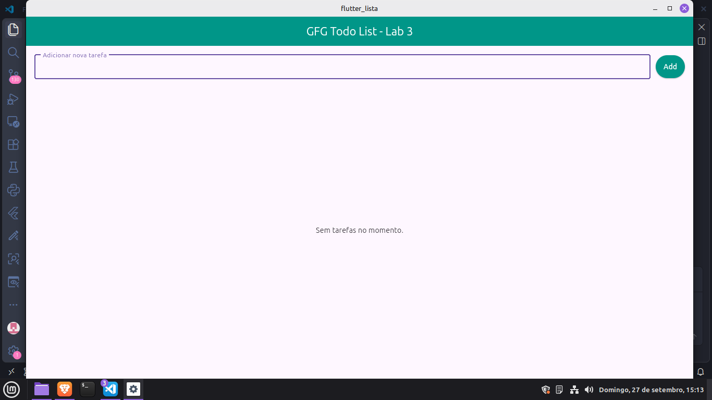
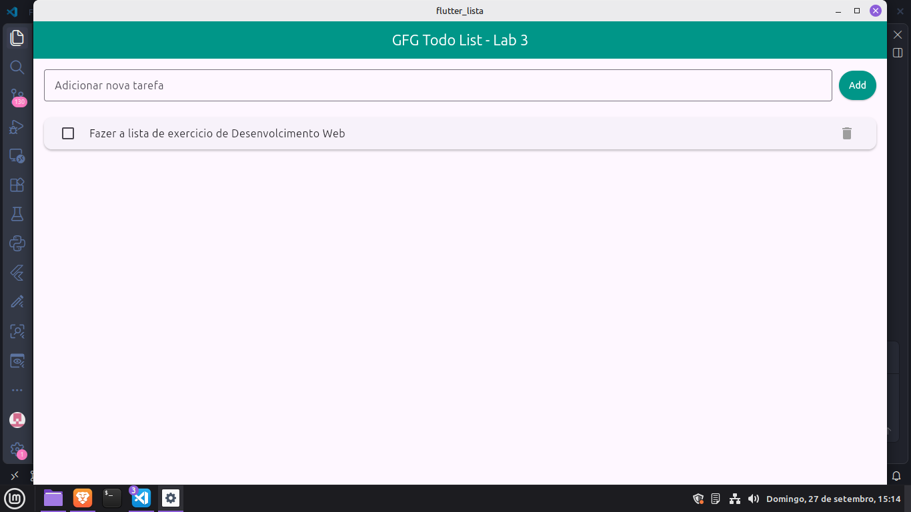
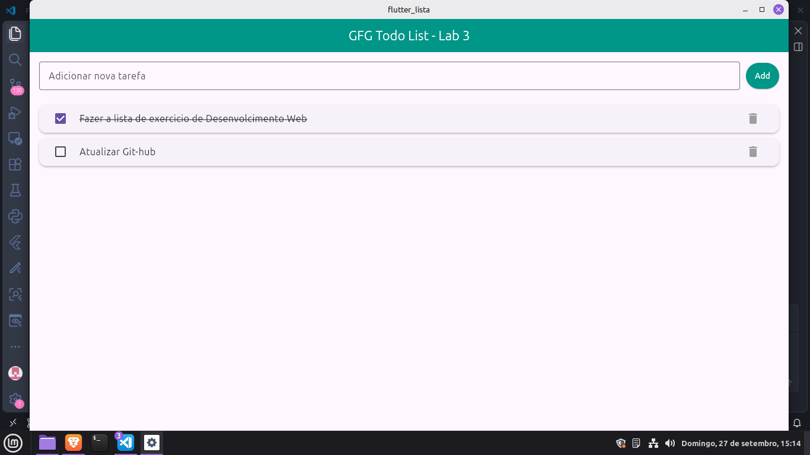

# Lista de Tarefas (Task List) - Desenvolvimento Mobile (Lab 3)

Aplicação de gerenciamento de tarefas desenvolvida em **Flutter e Dart** como solução prática para as **Questões 18 e 19** da lista de exercícios de Desenvolvimento Mobile do professor **MSc. Mateus de Paula**.

## 📄 Respostas Teóricas da Lista de execícios
As respostas das questões teóricas da lista foram compiladas e estão disponíveis para download e visualização direta no repositório:

[PDF](png/resolucao_lista.pdf)**

## Funcionalidades da Aplicação
- **Adicionar Tarefa:** Campo de entrada com botão `Add` para inserção de novas pendências.
- **Concluir Tarefa:** Seleção via `Checkbox` que aplica efeito visual de tachado no texto.
- **Remover Tarefa:** Exclusão individual de itens da lista via ícone de lixeira.

## Demonstração da Aplicação

|  |  |  |

---

##  Nota sobre o Ambiente de Execução
Devido a otimizações de hardware e execução nativa no ambiente de desenvolvimento, o projeto foi executado via browser:

```bash
flutter run -d chrome

TodoGeeksApp (MaterialApp)
  └── TodoListGeeks (Scaffold)
        ├── AppBar ("Lista de Tarefas - Lab 3")
        └── Padding (body)
              └── Column
                    ├── Row (Formulário Superior)
                    │     ├── Expanded -> TextField ("Adicionar nova tarefa")
                    │     └── ElevatedButton ("Add")
                    └── Expanded (Área da Lista)
                          └── ListView.builder
                                └── Card
                                      └── ListTile
                                            ├── Checkbox (Status da Tarefa)
                                            ├── Text (Título da Tarefa)
                                            └── IconButton (Icons.delete)